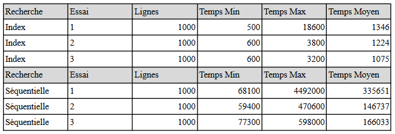

# Projet de recherche sur les SGBD du marché – SYBASE
Auteurs : Clara BENEDETTINI,
Hugo RULLIÈRE,
Lilian PETIT,
Julien BLETRY,
Arman HAKOBYAN

## I – Réalisation du projet
Pour mettre en place une recherche séquentielle, nous avons écrit une fonction qui parcourt les
éléments d'une collection les uns après les autres jusqu'à ce que l'élément recherché soit trouvé ou
que la fin de la collection soit atteinte. Notre collection est ici un fichier, qui est donc parcouru ligne
par ligne.
Pour ce qui est de la recherche par index, nous avons écrit une fonction qui récupère l’élément
recherché dans un HashMap, en utilisant une fonction de hachage pour calculer l'indice de stockage
correspondant à la clé donnée en entrée.
Le projet de développement peut être récupéré sur le repository Gi

## II - Rapport de recherche
Pour notre recherche, 3 jeux de données ont été utilisés. Contenant respectivement 1000, 10 000 et
50 000 lignes. Nous avons recherché pour chaque jeu de données, par index et de manière
séquentielle, 100 valeurs tirées aléatoirement. Voici les temps en nanosecondes que nous avons
enregistrées :

Nous pouvons constater, à la suite de cette étude, que la recherche par index est bien plus rapide que
la recherche séquentielle.

Nous avons également recherché plusieurs fois, par index et de manière séquentielle, 100 valeurs
tirées aléatoirement. Voici les temps en nanosecondes que nous avons enregistrées :

Nous pouvons constater, à la suite de cette étude, que la recherche par index est bien plus constante
en temps de recherche que la recherche séquentielle.

